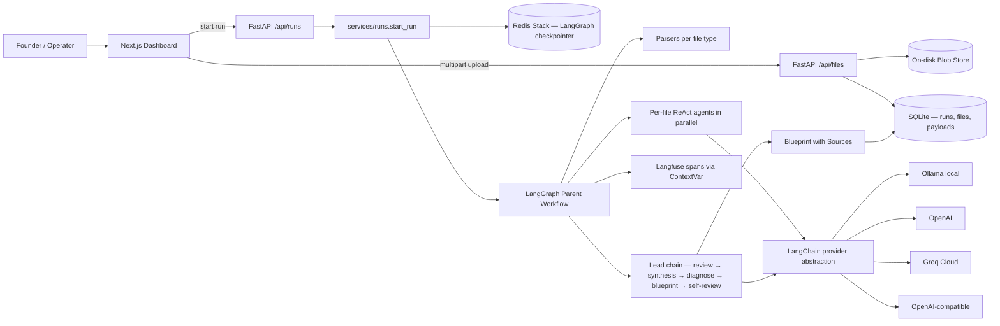
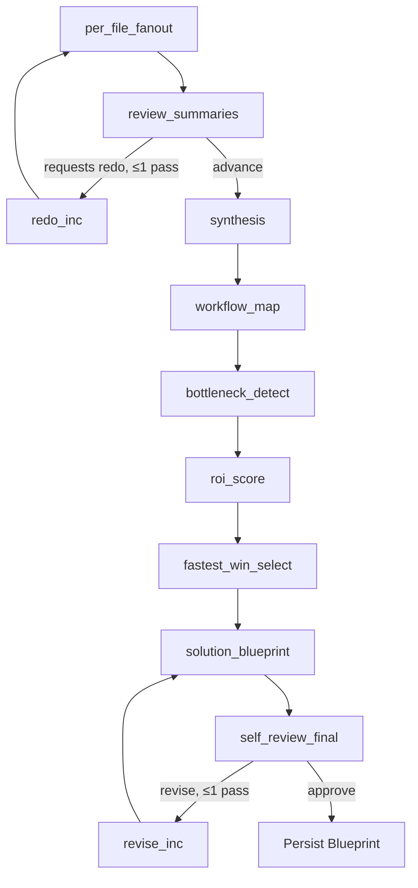

# Ops Diagnostic Agent

An AI-native operations diagnostic agent. Upload a folder of real ops files (PDFs, DOCXs, meeting transcripts, CSVs, MBOX exports, JSON dumps), and the system runs them through parallel per-file ReAct agents, synthesizes a cross-file picture, and produces a cited automation **Blueprint** via a deterministic 11-node LangGraph workflow with bounded redo + revision loops.

Every claim in the final blueprint round-trips through a real parser and a real LLM. No mock providers. No fixture-canned outputs. Citations are enforced by code, not trust.

---

## Architecture



11 nodes, two bounded loops (≤1 redo at `review_summaries`, ≤1 revision at `self_review_final`). Every `Source` in the final Blueprint must round-trip through `app.parsers.excerpt(parsed, locator)` and return non-empty text — the `self_review_final` node enforces this deterministically.

### Pipeline phases



Per-file agents are tool-routed ReAct loops over a fixed toolbelt (`search_text` with BM25, `read_segment`, `extract_workflow|pain_signal|lead_row`, `cite_locator`, `finalize_summary`). `cite_locator` is the only path that mints a `Source`, so every citation has round-tripped through a real parser before the loop can finalize.

---

## Tech stack

- **Backend:** Python 3.12, FastAPI, SQLAlchemy 2.x, Pydantic v2, LangGraph + Redis Stack (RedisJSON + RediSearch) checkpointer, LangChain (`langchain-openai`, `langchain-ollama`) for structured outputs, Langfuse v3 for tracing
- **Frontend:** Next.js 16 App Router + React 19, TypeScript strict, Tailwind v4, live WebSocket progress stream
- **Providers:** Ollama (default, local), OpenAI, Groq, generic OpenAI-compatible — selected via `LLM_PROVIDER` env var, all behind one `LLMProvider` Protocol with `generate_json(...)` + `chat_model(...)`
- **Persistence:** SQLite for dev (`PRAGMA foreign_keys=ON`, tz-aware UTC timestamps, cascade FKs on payload tables); Redis Stack for LangGraph state
- **Testing:** pytest + real services. **No mock LLM** — integration tests gate on `_ollama_up()` / `redis_healthcheck()`

---

## Quick start

```bash
# Backend
cd backend
make install                # uv venv + uv pip install -e ".[dev]"
cp .env.example .env        # set LLM_PROVIDER, OLLAMA_*, etc.
make fixtures               # regenerate parser test fixtures
make test-unit              # fast, in-process suite (182+ tests)
make dev                    # uvicorn on :8000

# Frontend (separate terminal)
cd frontend
npm install
npm run dev                 # next on :3000
```

Required services for the integration suite + running real diagnostic chains:

- **Ollama** with a chat-capable JSON-mode model pulled (`llama3.2:3b` or `llama3.1:8b`).
- **Redis Stack** at `REDIS_URL` — plain `redis-server` will not work (the LangGraph checkpointer needs `JSON.SET` + `FT.SEARCH`).
- **Langfuse** keys are optional; observability degrades to no-op when unset.

---

## Project layout

```
ops_diagnostic_agent/
├── backend/
│   ├── app/
│   │   ├── main.py                  # FastAPI: /health, /api/files, /api/runs, /api/runs/{id}/events (WS)
│   │   ├── config.py                # @lru_cache get_settings() reading .env
│   │   ├── database.py              # SQLAlchemy 2.x engine + SessionLocal; SQLite PRAGMA foreign_keys=ON
│   │   ├── models.py                # ORM: runs, files, file_summaries, intake_bundles, blueprints
│   │   ├── schemas.py               # Every typed boundary; locator union; ExtractionError
│   │   ├── state.py                 # DiagnosticState TypedDict — errors uses Annotated[list, operator.add]
│   │   ├── graph.py                 # 11-node LangGraph; rehydrates parsed_files on resume
│   │   ├── registry.py              # Single source of truth for {file_type → per-file agent}
│   │   ├── checkpointer.py          # Redis Stack LangGraph checkpointer
│   │   ├── observability.py         # Cached Langfuse v3 client + CallbackHandler factory
│   │   ├── run_events.py            # Thread-safe in-process WebSocket event hub
│   │   ├── blob_store.py            # Path-traversal-safe on-disk blob store
│   │   ├── parsers/                 # 10 file-type parsers + excerpt round-trip
│   │   ├── agents/
│   │   │   ├── lead/                # 8 single-shot LLM nodes (review → synthesis → diagnose → blueprint)
│   │   │   └── per_file/            # ReAct loop + 7 thin per-type wrappers via app.registry
│   │   ├── llm/                     # LangChainJSONProvider base + ollama/openai/groq/openai_compat
│   │   └── services/                # files.upload_file, runs.start_run, runs.get_blueprint
│   └── tests/{unit,integration}/    # 182+ unit, integration gates on real services
├── frontend/                        # Next.js 16 dashboard — upload, live progress, blueprint viewer
├── docs/
│   ├── architecture.md              # Current architecture + recent hardening pass
│   ├── demo_script.md               # 5-minute demo walkthrough
│   ├── requirements.md              # Spec (FR + NFR)
│   ├── project_glossary.md          # Domain + architecture terms
│   ├── file_responsibility_map.md   # One line per backend module
│   └── superpowers/{specs,plans}/   # Design + implementation docs for major changes
├── samples/                         # Realistic ops files for the end-to-end demo
└── audit.md                         # Post-hardening audit + resolved-in commit map
```

---

## Engineering posture

This repo has been hardened against the structural flaws cataloged in [`audit.md`](audit.md). Notable invariants enforced at HEAD:

- **Citation invariant.** Every `Source` round-trips through a real parser. `self_review_final` enforces existence + reachability deterministically; per-file `cite_locator` enforces it before any FileSummary finalizes.
- **No silent drops.** `LLMParseError` is raised whenever a provider returns `parsed_json=False`; graph wrappers append a structured `ExtractionError` to `state.errors`. `DiagnosticState.errors` is annotated with `operator.add` so LangGraph accumulates errors automatically across nodes.
- **Resumable.** On worker restart with a fresh process, `per_file_fanout` re-parses files from `FileRef.blob_path` instead of silently skipping (Redis-checkpointed state does not carry bulky `ParsedFile` segments — they re-hydrate from disk).
- **Bounded concurrency.** `POST /api/runs` dispatches via `asyncio.create_task` gated by an `asyncio.Semaphore(max_concurrent_runs)`. Tasks are held in a module-level set with a done-callback that marks `run.status='error'` on uncaught exceptions, so failed dispatches never lock a run in `running` forever.
- **Upload safety.** `POST /api/files` rejects unknown MIME types (415), streams uploads in 1 MiB chunks against `max_upload_mb` (413), and sanitizes filenames against path traversal before any disk write.
- **Real systems only.** No mock LLM provider exists in the codebase, by policy. Tests touch real Ollama, real Redis Stack, real SQLite. CI runs against local Ollama with `temperature=0` for deterministic invariants.

See [`audit.md`](audit.md) for the full inventory + the commit map that resolved each item.

---

## Deployment status

**Not deployed.** The project runs locally via `make dev` (backend) and `npm run dev` (frontend) against a local Ollama daemon and a local Redis Stack tarball. The architecture is container-friendly — services have clean boundaries, all configuration is environment-driven via `pydantic-settings`, and side effects are isolated to the services layer — but container artifacts are not yet committed.

---

## Documentation

- [`docs/architecture.md`](docs/architecture.md) — current architecture, including the structural hardening pass and the LangChain provider migration
- [`docs/demo_script.md`](docs/demo_script.md) — five-minute demo walkthrough
- [`docs/requirements.md`](docs/requirements.md) — functional + non-functional requirements
- [`docs/project_glossary.md`](docs/project_glossary.md) — domain + architecture vocabulary
- [`docs/file_responsibility_map.md`](docs/file_responsibility_map.md) — one-line description per backend module
- [`CLAUDE.md`](CLAUDE.md) — engineering standards used to build this project (TDD, real-systems-only, no Claude-trailer commits)
- [`audit.md`](audit.md) — post-merge hardening audit + resolved-in commit map
