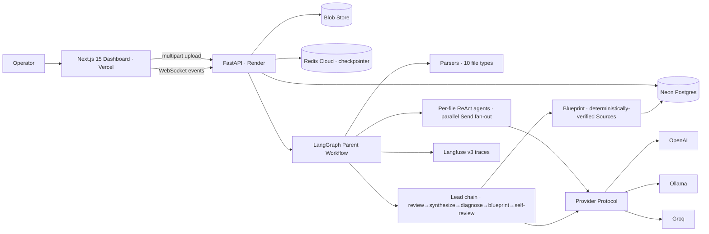
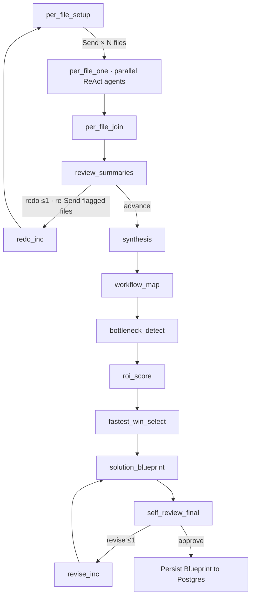

# Ops Diagnostic Agent

> **The hard part of agent integration isn't building the agent - it's figuring out which workflows are worth automating in the first place.** This tool does exactly that.

Upload a client's messy ops artifacts - PDFs, meeting transcripts, CSVs, mailboxes, CRM/Salesforce exports - and get back a **cited, ROI-scored automation blueprint**. A discovery-phase accelerator for the work automation teams already sell: it surfaces the workflows worth automating, ranks them by ROI, picks the fastest win, and proves every claim against the source document. **Every citation is verified by code, not trusted from the model.**

---

## What it does

- **In** → a folder of unstructured operational files (10 formats: PDF, DOCX, VTT/SRT transcripts, CSV, XLSX, MBOX, JSON).
- **Out** → a structured Blueprint: bottlenecks detected → opportunities ROI-scored → fastest win selected → automation steps, each cited to the exact span of the exact file.
- **Guarantee** → every `Source` round-trips through a real parser. No hallucinated evidence, by construction.
- **For** → automation agencies, AI-integration consultancies, and ops teams deciding *what* to automate **before** burning a sprint building it.

## The problem it solves

| | |
|---|---|
| **The real bottleneck** | Discovery, not build. Deciding *which* workflows to automate is the expensive, manual, judgment-heavy part - and it's what gets skipped. |
| **The raw material** | Signal is buried across calls, exports, mailboxes, audits, workbooks - scattered, contradictory, impossible to triangulate by hand in a useful timeframe. |
| **Why naive AI agents fail** | ① hallucinate citations ② swallow failures silently ③ break the moment they touch a real provider/DB/file ④ produce prose, not an executable artifact. |
| **How this refuses all four** | ① code-enforced citation round-trip ② typed errors that never vanish ③ real systems only - no mocks ④ structured, ROI-scored Blueprint you can act on. |

---
<!--
## Live demo

| Resource | URL |
|---|---|
| Frontend (Vercel) | https://ops-diagnostic-agent.vercel.app |
| Backend API + Swagger | https://ops-diagnostic-agent.onrender.com/docs |
| Health probe | https://ops-diagnostic-agent.onrender.com/health |

> Backend is on Render free tier - cold-starts in ~30–60 s after idle. Hit `/health` once before a run.

--/
!-->

## How it works

### System Architecture



**Pipeline at a glance:**
- **Fan-out (map):** one ReAct agent per file runs in parallel via LangGraph `Send`, capped by `per_file_concurrency`; each extracts workflows / pain signals / leads with a BM25 toolbelt.
- **Fan-in (reduce):** parallel branches merge through state reducers (dict-merge on summaries, `operator.add` on errors).
- **Diagnose:** lead chain synthesizes a cross-file picture → maps workflows → detects bottlenecks → **ROI-scores opportunities** → selects the fastest win → writes the Blueprint.
- **Self-correct:** two bounded loops - redo (≤1) re-runs only flagged files; revise (≤1) rewrites the Blueprint if citations/consistency fail.
- **Verify:** the citation round-trip is re-checked deterministically before the Blueprint is accepted.

### The 13-node diagnostic chain



> **`cite_locator` is the only tool that mints a `Source`** - so every citation has already round-tripped through a real parser before a file summary can finalize.

---

## Why you can trust the output

- **Citation invariant (enforced in code).** Every `Source` must round-trip through `parsers.excerpt(parsed, locator)` and return non-empty text - checked at the per-file tool *and* re-verified in `self_review_final`. No LLM self-certifies its evidence.
- **No silent drops.** Unparseable model output raises `LLMParseError` → structured `ExtractionError` accumulated in state. Even error paths are covered by deterministic tests.
- **Real systems only.** No mock LLM provider exists, by policy. Unit tests are deterministic + in-process; integration tests hit real Ollama / Redis Stack.

---

## Engineering highlights

- **Parallel `Send` map-reduce** with reducer-merged state - bounded by `per_file_concurrency` so a 50-file upload can't open 50 provider connections.
- **Strict typed boundaries** - Pydantic v2, `TypedDict` state, `Literal` enums, 8-variant typed locator union (page ranges → transcript timestamps → email refs → JSON-pointer).
- **Resumable execution** - survives worker restart; `per_file_one` rehydrates parsed files from blob storage on demand (Redis checkpointer omits bulky segments).
- **Bounded concurrency, two levels** - `asyncio.Semaphore` on run dispatch (with done-callbacks so a run never sticks in `running`) + LangGraph `max_concurrency` on the fan-out.
- **Upload safety** - MIME allow-list (415), 1 MiB chunked streaming vs size cap (413), path-traversal-safe filenames.
- **Production-hardened persistence** - `pool_pre_ping` + `pool_recycle` against Neon's idle-in-transaction timeout (a real bug, traced from prod logs and fixed).
- **Distributed observability** - Langfuse v3 traces + structlog, trace context via `ContextVar`, no-op when keys unset.

<details>
<summary><b>Two debugging stories worth a look</b></summary>

- **Idle-in-transaction crash.** A run finished all AI work, then lost the Blueprint on write - `start_run` held one Postgres transaction open across ~6 min of LLM work and Neon killed the idle session. Fix: commit right after marking the run `running`; add `pool_pre_ping`/`pool_recycle`. *Lesson: hold a transaction for the SQL, never for the AI.*
- **A latent crash found by systematic debugging.** During the sequential→parallel migration, runs kept failing. Deterministic, LLM-free probes isolated *wiring* from *model variance* - proving the fan-out correct and tracing the fault to an error-path `emit()` that passed `stage` twice, so any parse error crashed the *error handler itself*. Fixed across 9 sites with regression tests, and empirically confirmed sync `invoke` honors `max_concurrency` (no async rewrite needed).
</details>

---

## Tech stack

**Backend** - Python 3.12 · FastAPI · SQLAlchemy 2.x · Pydantic v2 · LangGraph (`Send` map-reduce, reducer-merged state) · langgraph-checkpoint-redis · LangChain (OpenAI / Ollama / Groq / OpenAI-compatible) · BM25 retrieval · Langfuse v3 · structlog · psycopg v3

**Frontend** - Next.js 15.5 (App Router) · React 19 · TypeScript (strict) · Tailwind v4 · live WebSocket progress

**Infra** - Vercel · Render · Neon Postgres · Redis Stack on Redis Cloud (RedisJSON + RediSearch) · Langfuse Cloud - every boundary env-driven via `pydantic-settings` (provider/DB/host swaps are config, not code)

---

## Quick start

```bash
# Backend
cd backend
make install          # uv venv + uv pip install -e ".[dev]"
cp .env.example .env   # set LLM_PROVIDER + provider keys
make test-unit         # fast in-process suite (250+ tests)
make dev               # uvicorn on :8000

# Frontend
cd frontend && npm install && npm run dev   # next on :3000
```

**Services for real runs / integration tests:** Ollama (`llama3.2:3b`/`llama3.1:8b`) **or** `OPENAI_API_KEY` · Redis **Stack** at `REDIS_URL` (plain `redis-server` won't work - needs `JSON.SET`/`FT.SEARCH`) · Postgres at `DATABASE_URL` (or omit → SQLite) · Langfuse keys optional.

---

## What this codebase demonstrates

| Capability | Where |
|---|---|
| Citation safety as a hard, code-enforced invariant | `app/agents/lead/self_review_final.py`, `cite_locator` tool |
| Production LangGraph workflow + structured state | `app/graph.py`, `app/state.py` |
| Parallel `Send` map-reduce with reducer-merged state | `app/graph.py` (`dispatch_fanout`, `per_file_one`, `per_file_join`), `app/state.py` |
| Per-file ReAct loop with tool routing + bounded iteration | `app/agents/per_file/_react_loop.py`, `_tools/` |
| Strict typed boundaries (Pydantic v2, TypedDict, Literal) | `app/schemas.py` |
| Provider abstraction (OpenAI / Ollama / Groq) | `app/llm/` |
| Real persistence (Postgres, Redis, blob store) | `app/database.py`, `checkpointer.py`, `blob_store.py` |
| Resumable execution (survives worker restart) | `per_file_one` re-parses from `FileRef.blob_path` |
| Observability (Langfuse v3 + ContextVar) | `app/observability.py` |
| Production DB lifecycle fix (idle-in-transaction) | `app/database.py`, `app/services/runs.py` |
| TDD discipline (250+ unit tests, real-service integration) | `backend/tests/` |

---

## Author

**Kushal Regmi** · [GitHub](https://github.com/KushalRegmi61) · [LinkedIn](https://www.linkedin.com/in/kushal-regmi-0b88a42aa) · kushalregmi432@gmail.com
