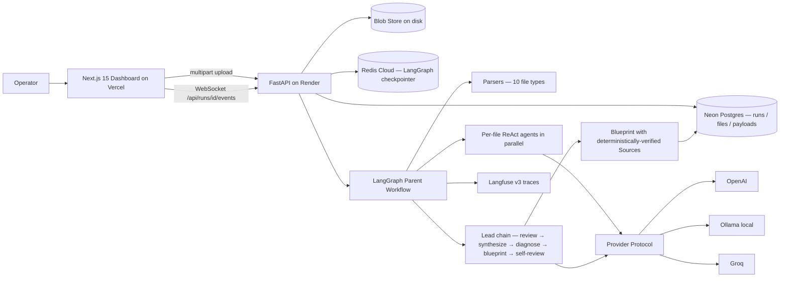
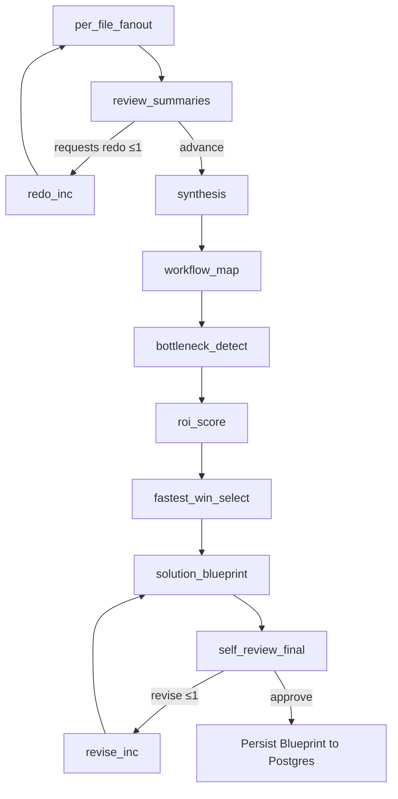
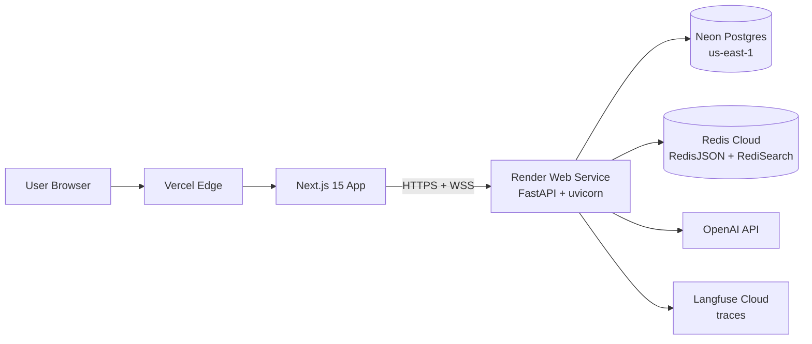

# Ops Diagnostic Agent

> Upload a folder of real operational artifacts. Get back a cited, executable automation blueprint.

A production-grade, AI-native operations diagnostic system. Ingests messy real-world ops files (PDFs, DOCXs, meeting transcripts, CSVs, MBOX exports, JSON dumps, XLSX workbooks), runs them through parallel per-file ReAct agents, synthesizes a cross-file picture, and produces a cited automation Blueprint via a deterministic 11-node LangGraph workflow with bounded redo and revision loops.

Every claim in the final Blueprint round-trips through a real parser and a real LLM. No mock providers. No fixture-canned outputs. Citations are enforced by code, not trust.

---

## Live demo

| Resource | URL |
|---|---|
| Frontend (Vercel) | https://ops-diagnostic-agent.vercel.app |
| Backend API + Swagger | https://ops-diagnostic-agent.onrender.com/docs |
| Health probe | https://ops-diagnostic-agent.onrender.com/health |

The backend is hosted on Render's free tier and cold-starts in roughly 30–60 seconds after idle. Give it one slow `/health` request before kicking off a run.

A typical end-to-end run with 10 mixed-format files takes ~6–7 minutes on `gpt-4.1-mini` (parallel per-file ReAct + bounded redo + 8 lead nodes + bounded revision + deterministic citation round-trip).

---

## The problem this solves

Operations teams sit on top of a mountain of unstructured artifacts (calls, exports, mailboxes, audit PDFs, sales workbooks) that contain *real* signal about where their business is bottlenecked. The signal is buried, scattered across formats, and impossible for a human to triangulate in a useful timeframe.

Most "AI agents" that try to do this fall over for one of four reasons:

1. They hallucinate citations that don't exist in the source.
2. They drop silent failures into JSON and call it success.
3. They wire the demo to mocks and break the moment they touch reality.
4. They produce prose, not an actionable artifact you can execute against.

This project is built specifically to refuse all four. It is structured around a single load-bearing invariant: **every `Source` in the output must round-trip through `parsers.excerpt(parsed, locator)` and return non-empty text**, enforced by a deterministic check before any LLM gets to "approve" the Blueprint.

---

## Architecture



### The 11-node diagnostic chain



Two bounded loops:
- **Redo loop** at `review_summaries` (≤1 pass) — the lead agent can demand specific per-file agents re-run with targeted revision requests.
- **Revision loop** at `self_review_final` (≤1 pass) — the final review agent can demand one rewrite of the Blueprint if the citation round-trip or internal consistency fails.

Per-file agents are tool-routed ReAct loops over a fixed toolbelt: `search_text` (BM25), `read_segment`, `extract_workflow | pain_signal | lead_row`, `cite_locator`, `finalize_summary`. **`cite_locator` is the only path that mints a `Source`** — every citation has already round-tripped through a real parser before the loop is allowed to finalize.

---

## What this demonstrates

For hiring managers reading this as a portfolio piece, here is exactly what this codebase is evidence of:

| Capability | Where to look |
|---|---|
| Production LangGraph workflow with structured state | `backend/app/graph.py`, `backend/app/state.py` |
| Per-file ReAct loop with tool routing and bounded iteration | `backend/app/agents/per_file/_react_loop.py`, `_tools/` |
| Strict typed boundaries (Pydantic v2, TypedDict, Literal) | `backend/app/schemas.py` |
| Provider abstraction across OpenAI / Ollama / Groq | `backend/app/llm/` |
| Real persistence across Postgres, Redis, blob store | `backend/app/database.py`, `checkpointer.py`, `blob_store.py` |
| Observability with Langfuse v3 + ContextVar trace propagation | `backend/app/observability.py` |
| Resumable execution (state survives worker restart) | `per_file_fanout` re-parses from `FileRef.blob_path` |
| Live WebSocket progress streaming | `backend/app/run_events.py`, `frontend/components/RunStream` |
| Citation safety as a hard invariant | `backend/app/agents/lead/self_review_final.py` |
| TDD discipline (182+ unit tests, real-service integration tests) | `backend/tests/` |
| Real cloud deployment with idle-tx + free-tier-aware engineering | `app/database.py` (`pool_pre_ping`), `app/services/runs.py` |

---

## Engineering highlights

- **Citation invariant.** Every `Source` round-trips through a real parser. `self_review_final` enforces existence and reachability deterministically. The per-file `cite_locator` tool enforces it before any FileSummary finalizes. Locator union has 8 typed variants covering page ranges, segment indices, time ranges, email-message refs, and JSON-pointer-style addressing.
- **No silent drops.** `LLMParseError` is raised whenever a provider returns `parsed_json=False`. Graph wrappers append a structured `ExtractionError` to `state.errors`. `DiagnosticState.errors` is annotated with `operator.add` so LangGraph accumulates errors automatically across parallel nodes.
- **Resumable.** On worker restart, `per_file_fanout` re-parses files from disk rather than silently skipping (Redis-checkpointed state does not carry bulky `ParsedFile` segments — they rehydrate on demand).
- **Bounded concurrency.** `POST /api/runs` dispatches via `asyncio.create_task` gated by an `asyncio.Semaphore(max_concurrent_runs)`. Tasks are tracked in a module-level set with a done-callback that marks `run.status='error'` on uncaught exceptions, so failed dispatches never lock a run in `running` forever.
- **Upload safety.** `POST /api/files` rejects unknown MIME types (415), streams uploads in 1 MiB chunks against `max_upload_mb` (413), and sanitizes filenames against path traversal before any disk write.
- **Production-aware DB pooling.** SQLAlchemy engine uses `pool_pre_ping=True` and `pool_recycle=300` on Postgres deployments — defense against Neon's idle-in-transaction timeout that kills connections after ~5 minutes (a real bug caught in production logs and fixed in commit `b08010e`).
- **Cost-aware Redis TTL.** LangGraph checkpoint TTL is hard-capped at 10 minutes via a pydantic validator, so config drift cannot silently bloat retention beyond Redis Cloud's free-tier 30 MB cap.
- **Real systems only.** No mock LLM provider exists in the codebase by policy. Integration tests gate on `_ollama_up()` / `redis_healthcheck()`. CI runs against a local Ollama with `temperature=0` for deterministic invariants.

---

## Tech stack

**Backend**
- Python 3.12 · FastAPI · SQLAlchemy 2.x · Pydantic v2
- LangGraph + langgraph-checkpoint-redis (Redis Stack with RedisJSON + RediSearch)
- LangChain provider clients for OpenAI, Ollama, Groq, generic OpenAI-compatible
- Langfuse v3 for traces and prompt-level observability
- psycopg v3 driver for Postgres, with auto-normalized DSN handling

**Frontend**
- Next.js 15.5 (App Router) · React 19 · TypeScript strict
- Tailwind v4 · Lucide icons
- Live WebSocket progress streaming on `/api/runs/{id}/events`

**Infrastructure**
- Frontend hosted on Vercel
- Backend hosted on Render (free tier)
- Postgres on Neon (free tier, pooled connection with `channel_binding=require`)
- Redis Stack on Redis Cloud (free tier, 30 MB, RedisJSON + RediSearch modules pre-enabled)
- Langfuse Cloud for tracing

---

## Quick start

```bash
# Backend
cd backend
make install                    # uv venv + uv pip install -e ".[dev]"
cp .env.example .env            # set LLM_PROVIDER and provider keys
make test-unit                  # fast, in-process suite (182+ tests)
make dev                        # uvicorn on :8000

# Frontend (separate terminal)
cd frontend
npm install
npm run dev                     # next on :3000
```

Required services for the integration suite and running real diagnostic chains:

- **Ollama** with a chat-capable JSON-mode model pulled (`llama3.2:3b` or `llama3.1:8b`), OR an `OPENAI_API_KEY` in `.env`.
- **Redis Stack** at `REDIS_URL` — plain `redis-server` will not work (the LangGraph checkpointer needs `JSON.SET` and `FT.SEARCH`).
- **Postgres** (Neon or local) at `DATABASE_URL`, or omit to default to SQLite.
- **Langfuse** keys are optional. Observability degrades to a no-op when unset.

---

## Project layout

```
ops_diagnostic_agent/
├── backend/
│   ├── app/
│   │   ├── main.py                 FastAPI: /health, /api/files, /api/runs, /api/runs/{id}/events (WS)
│   │   ├── config.py               @lru_cache get_settings() reading .env
│   │   ├── database.py             SQLAlchemy engine with pool_pre_ping + URL normalizer
│   │   ├── models.py               ORM tables: runs, files, file_summaries, intake_bundles, blueprints
│   │   ├── schemas.py              Every typed boundary; 8-variant locator union; ExtractionError
│   │   ├── state.py                DiagnosticState TypedDict with operator.add error accumulation
│   │   ├── graph.py                11-node LangGraph; rehydrates parsed_files on resume
│   │   ├── registry.py             Single source of truth for {file_type → per-file agent}
│   │   ├── checkpointer.py         Redis Stack LangGraph checkpointer with TTL cap
│   │   ├── observability.py        Langfuse v3 client + CallbackHandler factory
│   │   ├── run_events.py           Thread-safe in-process WebSocket event hub
│   │   ├── blob_store.py           Path-traversal-safe on-disk blob store
│   │   ├── parsers/                10 file-type parsers + excerpt round-trip
│   │   ├── agents/
│   │   │   ├── lead/               8 single-shot LLM nodes
│   │   │   └── per_file/           ReAct loop + 7 per-type wrappers via app.registry
│   │   ├── llm/                    Provider Protocol + ollama / openai / groq / openai_compat
│   │   └── services/               files.upload_file, runs.start_run, runs.get_blueprint
│   └── tests/{unit,integration}/   182+ unit tests; integration tests gate on real services
└── frontend/                       Next.js dashboard — upload, live progress, blueprint viewer
```

---

## Deployment topology



Every external boundary is environment-driven via `pydantic-settings`. Switching providers (OpenAI → Ollama → Groq), DBs (Postgres → SQLite), or hosts is a configuration change, not a code change.

---

## Roadmap

- Containerize backend (Dockerfile + docker-compose for local Ollama + Redis Stack + Postgres).
- Move blob store off the Render ephemeral filesystem (S3 or Cloudflare R2).
- Add an `/api/runs/{id}/replay` endpoint that re-executes from a Redis checkpoint, for cheap debugging without re-burning LLM tokens.
- First-class evaluation harness: golden runs with assertions on `bundle.workflows`, `blueprint.steps`, and citation reachability.

---

## Author

**Kushal Regmi** — Applied AI Engineer focused on production agents, full-stack AI systems, retrieval infrastructure, and the messy parts of making AI useful in real businesses.

- GitHub: https://github.com/KushalRegmi61
- LinkedIn: https://www.linkedin.com/in/kushal-regmi-0b88a42aa
- Email: kushalregmi432@gmail.com

If you're hiring for production AI engineering and this codebase looks like the kind of work you need done, I'd love to talk.
