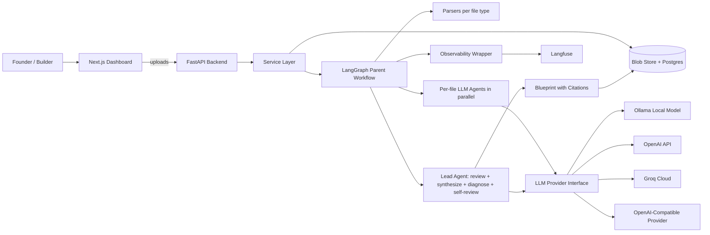
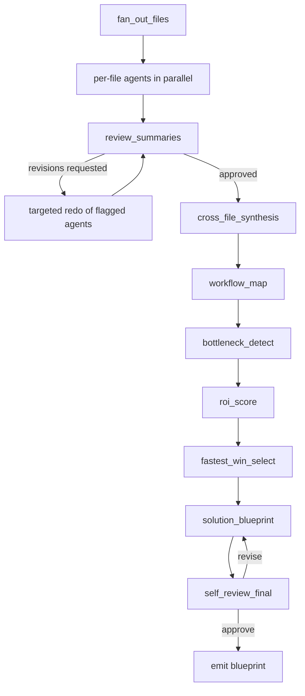
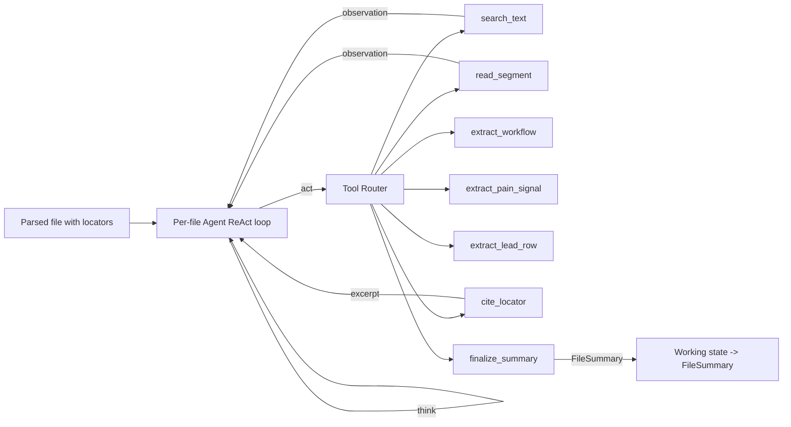
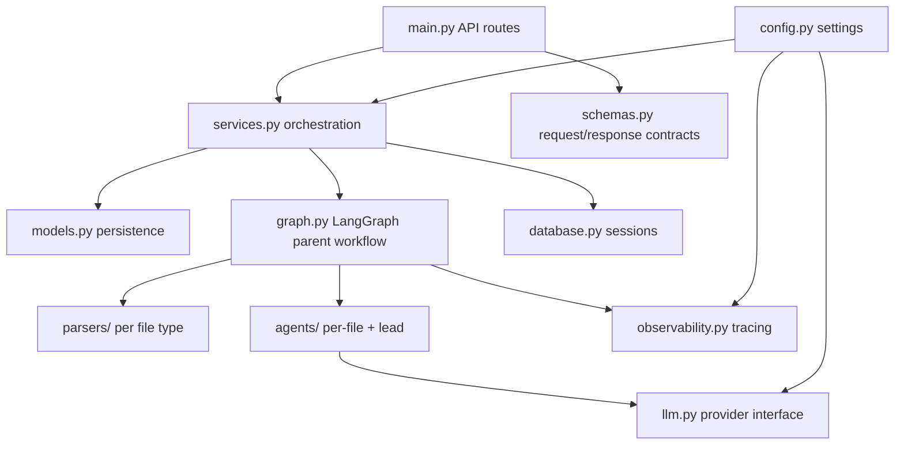
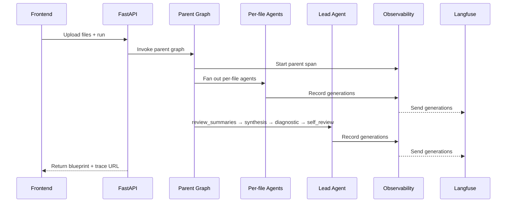

# Architecture

This document describes the target architecture for the AI-Native Ops Diagnostic Agent. The system is a **multi-agent pipeline**: parallel per-file agents read uploaded ops files and emit typed `FileSummary` objects; a sequence of lead-role agents (reviewer → synthesizer → five diagnostic agents → self-reviewer) consume each other's typed outputs to produce a cited automation blueprint. Authoritative source: [`superpowers/specs/2026-05-23-real-files-diagnostic-redesign-design.md`](superpowers/specs/2026-05-23-real-files-diagnostic-redesign-design.md).

## Multi-Agent Pipeline

Every agent has a narrow job, a typed input, and a typed output. One agent's output is the next agent's input. The LangGraph parent workflow is the wiring diagram.

```mermaid
flowchart LR
  FILES[Uploaded files] --> PARSE[Parsers]
  PARSE -->|ParsedFile| A1[per-file agent #1]
  PARSE -->|ParsedFile| A2[per-file agent #2]
  PARSE -->|ParsedFile| AN[per-file agent #N]
  A1 -->|FileSummary| REVIEW
  A2 -->|FileSummary| REVIEW
  AN -->|FileSummary| REVIEW[Reviewer agent]
  REVIEW -->|SummaryReview: requests redo| A1
  REVIEW -->|approved| SYNTH[Synthesizer agent]
  SYNTH -->|IntakeBundle| WFM[workflow_map agent]
  WFM -->|workflows| BD[bottleneck_detect agent]
  BD -->|bottlenecks| ROI[roi_score agent]
  ROI -->|opportunities| FW[fastest_win_select agent]
  FW -->|selected| SB[solution_blueprint agent]
  SB -->|Blueprint| SR[Self-review agent]
  SR -->|FinalReview: revise| SB
  SR -->|approved| EMIT[Emit cited blueprint]
```



Per-file agents (10+ instances, one per uploaded file) → reviewer → synthesizer → five diagnostic-chain agents → self-reviewer = nine distinct agent roles wired by typed handoffs.

## Architecture Goals

- local-first for development
- provider-flexible for LLM calls
- safe by default (no real outbound actions in v1)
- observable end-to-end via Langfuse
- understandable in a hiring conversation
- works on real input files, not pasted text or fixtures
- no mock LLM providers; every layer runs against a real model

## System Diagram



## Runtime Modes

There is no mock mode. CI and local development run against a local Ollama model; demos run against hosted models.

### Ollama Mode (default for CI and dev)

```bash
LLM_PROVIDER=ollama
OLLAMA_BASE_URL=http://localhost:11434
OLLAMA_MODEL=llama3.1:8b
```

Used with `temperature=0` so structural assertions are stable across runs.

### OpenAI Mode

```bash
LLM_PROVIDER=openai
OPENAI_API_KEY=...
OPENAI_MODEL=gpt-4.1-mini
```

### Groq Cloud Mode

```bash
LLM_PROVIDER=groq
GROQ_API_KEY=...
GROQ_BASE_URL=https://api.groq.com/openai/v1
GROQ_MODEL=llama-3.3-70b-versatile
```

### Generic OpenAI-Compatible Mode

```bash
LLM_PROVIDER=openai_compatible
OPENAI_COMPATIBLE_API_KEY=...
OPENAI_COMPATIBLE_BASE_URL=https://your-provider.example/v1
OPENAI_COMPATIBLE_MODEL=your-model-id
```

### Optional per-node provider override

Heavy lead-agent nodes can target a stronger hosted model while per-file agents stay on local Ollama, controlled by `LLM_PROVIDER_FOR_<NODE>` env vars. Off by default.

## Parent Workflow Graph



Bounded loops: at most one redo cycle in `review_summaries`, at most one revision in `self_review_final`.

## Per-file Agents (Tool-Routed ReAct)

Each uploaded file gets exactly one LLM agent. Agents run in parallel and emit a typed `FileSummary` with citations. They are summarizers, not deciders — they never score opportunities or pick winners.

Each agent is implemented as a **ReAct loop** over a fixed toolbelt routed by an explicit dispatcher. This is the place this project exercises ReAct + tool routing:



Router invariants:

- one tool call per iteration,
- typed argument validation (Pydantic) at the router boundary,
- iteration cap (default 6) — exceeded → emit partial state with caveat,
- `cite_locator` is the only path that produces a `Source`, so every citation has roundtripped through the parser.

In-file retrieval (`search_text`) is the v1 retrieval primitive: token-overlap + substring scoring localized to a single file. No cross-file vector store; that's v2 (spec §16.2).

Supported file types and locator payloads:

| Type | Parser | Locator |
|---|---|---|
| PDF | PyMuPDF | `{ page, span_start, span_end }` |
| DOCX | python-docx | `{ paragraph_index, span_start, span_end }` |
| MD / TXT | builtin | `{ line_start, line_end }` |
| `.vtt` transcript | webvtt-py | `{ line_start, line_end, ts_start, ts_end }` |
| `.srt` transcript | srt | `{ line_start, line_end, ts_start, ts_end }` |
| CSV | pandas | `{ row_index }` |
| XLSX | openpyxl/pandas | `{ sheet, row_index }` |
| MBOX | mailbox | `{ message_id, header_or_body }` |
| JSON | builtin | `{ pointer }` (RFC 6901) |

## Lead Agent

The lead agent owns all cross-file reasoning. It runs four phases as distinct LangGraph nodes:

1. `review_summaries` — checks per-file outputs for missing info, contradictions, weak citations, ignored open questions; emits revision requests (bounded to one redo cycle).
2. `cross_file_synthesis` — reconciles findings into an `IntakeBundle`, preserving contradictions with both citations rather than silently merging.
3. Diagnostic chain — `workflow_map → bottleneck_detect → roi_score → fastest_win_select → solution_blueprint`. Every record carries `sources`.
4. `self_review_final` — audits citation existence, citation reachability, no-silent-drops, and internal consistency; can revise once.

## Data Flow

- Files are uploaded by the user. Parsers turn them into anchored content artifacts.
- Per-file agents emit typed `FileSummary` records.
- Lead agent reviews, synthesizes into `IntakeBundle`, runs the diagnostic chain, and self-reviews.
- Every workflow, bottleneck, opportunity, and blueprint claim carries `sources: list[Source]` pointing back to specific page/line/row/message locators.
- Langfuse receives one nested trace per run.

## Backend Layers



Layer responsibilities:

- `main.py`: receives HTTP requests, handles uploads.
- `services.py`: coordinates blob storage, database, graph, and traces.
- `graph.py`: defines the parent LangGraph workflow and lead-agent node chain.
- `parsers/`: one module per file type, deterministic, no LLM.
- `agents/`: per-file agent definitions and the lead agent.
- `llm.py`: hides provider-specific model calls.
- `observability.py`: records spans in Langfuse.
- `models.py`: database storage shape.
- `schemas.py`: API input/output shape.
- `config.py`: environment-driven settings.

## LLM Provider Design

The graph calls one stable interface:

```python
result, metadata = llm.generate_json(
    prompt_name="per_file_pdf_agent",
    prompt=prompt,
    schema=FileSummary,
)
```

The return metadata includes provider, model, prompt name, token estimate, parsed-JSON status, retry count, and latency. Sent to Langfuse on every call.

## State and Persistence

PostgreSQL stores durable records:

- `runs(run_id, status, created_at, langfuse_trace_id)`
- `files(file_id, run_id, file_name, mime_type, parsed_path, parser_status)`
- `file_summaries(file_id, json)`
- `intake_bundles(run_id, json)`
- `blueprints(run_id, json)`

SQLite is acceptable as a local fallback for the relational store.

### Redis as the LangGraph checkpointer (required)

Redis is required in v1 because the multi-agent design depends on cheap, correct resume between agents:

- **Reviewer redo loop.** When the reviewer agent emits `revision_requests`, the parent graph must resume from the post-fan-out checkpoint and re-run only the flagged per-file agents — successful agents and the parsing layer must not re-execute.
- **Self-review revision loop.** When self-review fails, the graph rewinds to `solution_blueprint` while preserving the upstream `IntakeBundle`, workflows, bottlenecks, opportunities, and selection.
- **Per-file failure isolation.** A single failed per-file agent is retried from its own checkpoint without disturbing siblings.
- **Long-run UI polling.** The UI reads checkpointed state directly; browser refresh never loses progress.
- **Single source of truth.** Every node writes the same `DiagnosticState`; every reader (UI, services, retries) sees the same checkpoint.

Configuration:

```bash
REDIS_URL=redis://localhost:6379/0
LANGGRAPH_CHECKPOINTER=redis
LANGGRAPH_CHECKPOINT_NAMESPACE=ops_diagnostic
```

Checkpoint identity is `(run_id)`. Checkpoints are written at every node boundary (LangGraph default). If Redis is unavailable, the backend refuses to start a new run — there is no in-memory checkpointer fallback in v1.

## Observability Flow



## Safety Boundary

v1 emits a cited blueprint and stops there. The original agent-run / approval-gate / drafted-action flow is deferred to v2 (see spec §16). No outbound actions, no CRM writes, no email sends.

## Production Story

- Real LLMs end-to-end. No mock providers in code.
- CI uses local Ollama with `temperature=0` for deterministic invariant tests.
- Demo uses a hosted model for quality.
- No outbound actions in v1.

## Demo Deploy (Docker)

The only supported deployment artifact in v1 is `docker-compose.yml` at the repo root, which orchestrates:

- `postgres` — application database.
- `redis` — LangGraph checkpointer.
- `ollama` — local LLM provider with the configured model preloaded.
- `backend` — FastAPI app built from `backend/Dockerfile`.
- `frontend` — Next.js app built from `frontend/Dockerfile`.

Each service has a health check. `make demo` runs `docker-compose up -d`, waits for backend health, uploads `/samples/` and triggers a run with `auto_approve=true`, then opens the browser. Out of scope for v1: Kubernetes, EC2, cloud deploys, CI/CD pipelines (honestly carried by CareGene evidence per [`resume_concept_map.md`](resume_concept_map.md)).

## Build Order

See [`build_from_scratch_plan.md`](build_from_scratch_plan.md) for the step-by-step build sequence aligned to the spec's §15.
