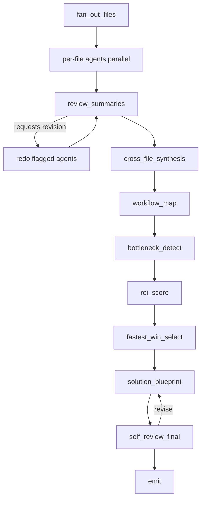

# Product Requirements Document

Project: AI-Native Ops Diagnostic Agent
Target audience: Agent Integrator cofounder / hiring team
Primary builder: Kushal Regmi
Demo vertical: Mid-market insurance agency
Authoritative spec: [`superpowers/specs/2026-05-23-real-files-diagnostic-redesign-design.md`](superpowers/specs/2026-05-23-real-files-diagnostic-redesign-design.md)

## 1. Executive Summary

The AI-Native Ops Diagnostic Agent is a **multi-agent system** that ingests the real files an ops team already has — SOPs, call transcripts, lead spreadsheets, CRM/email exports — and turns them into a cited automation roadmap. Parallel per-file agents read each file and emit typed `FileSummary` objects. A sequence of lead-role agents — reviewer, synthesizer, five diagnostic-chain agents, and a self-reviewer — consume each other's typed outputs to produce an evidence-backed blueprint. One agent's output is the next agent's input; the LangGraph parent workflow is the wiring diagram, and Redis is the checkpointer that makes the multi-agent redo and revision loops correct and cheap.

The project is designed for Agent Integrator because their business is about helping mid-market companies become AI-native: finding workflow bottlenecks, shipping useful automations quickly, and proving impact. The demo shows three things:

1. Kushal understands Agent Integrator's business model.
2. Kushal can build production-shaped agent systems that work on real input data, not pasted text or mocks.
3. Kushal can combine LangGraph, FastAPI, Postgres, frontend UX, and Langfuse observability into a working product story.

The first vertical is an insurance agency because it has recognizable operational pain: slow inbound leads, manual coverage classification, document-collection loops, hand-copied CRM notes, inconsistent follow-up, weak revenue-leak visibility.

## 2. The Problem

Many AI demos start with a prompt and produce a generic answer. This project starts with operational artifacts:

- Which workflows exist in the documents the business actually wrote down?
- Which workflows leak time or revenue, according to the transcripts and exports?
- Which automation is low effort and high ROI given that evidence?
- What would the first deployable workflow look like, and what does each claim cite?

## 3. Product Goal

A locally runnable web app that can:

1. Accept uploaded real ops files (PDF/DOCX/MD SOPs, .txt/.vtt/.srt transcripts, CSV/XLSX spreadsheets, CSV/MBOX/JSON email/CRM exports).
2. Parse each file with locator anchors preserved (page, line, row, message-id).
3. Run one LLM agent per file in parallel to produce a typed `FileSummary` with citations.
4. Have a single lead agent review per-file summaries, synthesize across files, run the diagnostic chain, and self-review the blueprint.
5. Emit a blueprint where every workflow, bottleneck, opportunity, and recommendation cites concrete file evidence.
6. Record one nested Langfuse trace per run.
7. Run against real LLM providers (Ollama / OpenAI / Groq / OpenAI-compatible). No mock provider.
8. Ship a `/samples` realistic dataset and a `make demo` that runs the full pipeline end-to-end.

## 4. Execution Modes

There are four execution modes. **There is no mock mode.** Every layer runs against a real model.

### 4.1 Ollama Mode — CI and dev default

```bash
LLM_PROVIDER=ollama
OLLAMA_BASE_URL=http://localhost:11434
OLLAMA_MODEL=llama3.1:8b
```

Used with `temperature=0` so tests assert structural invariants reliably.

### 4.2 OpenAI Mode — demo default

```bash
LLM_PROVIDER=openai
OPENAI_API_KEY=sk-...
OPENAI_MODEL=gpt-4.1-mini
```

### 4.3 Groq Cloud Mode

```bash
LLM_PROVIDER=groq
GROQ_API_KEY=...
GROQ_BASE_URL=https://api.groq.com/openai/v1
GROQ_MODEL=llama-3.3-70b-versatile
```

### 4.4 Generic OpenAI-Compatible Mode

```bash
LLM_PROVIDER=openai_compatible
OPENAI_COMPATIBLE_API_KEY=...
OPENAI_COMPATIBLE_BASE_URL=https://your-provider.example/v1
OPENAI_COMPATIBLE_MODEL=your-model-id
```

### 4.5 Optional per-node provider override

Heavy lead-agent nodes can target a stronger hosted model while per-file agents stay on local Ollama, via `LLM_PROVIDER_FOR_<NODE>` env vars. Off by default.

## 5. Scope

### 5.1 In Scope (v1)

- Local full-stack app (FastAPI + Next.js).
- Real-file uploads only; no paste box.
- Deterministic parsers for PDF/DOCX/MD/TXT/VTT/SRT/CSV/XLSX/MBOX/JSON.
- Parallel per-file LLM agents emitting typed `FileSummary` with citations.
- Single lead agent: `review_summaries` → `cross_file_synthesis` → diagnostic chain → `self_review_final`.
- Bounded review loops (one redo round, one revision pass).
- Citation enforcement at the blueprint boundary.
- PostgreSQL persistence (SQLite acceptable for local).
- Langfuse-only observability.
- LLM providers: `ollama`, `openai`, `groq`, `openai_compatible`.
- `/samples` realistic input dataset.
- `make demo` end-to-end script.

### 5.2 Out of Scope (v1)

- Mock LLM provider.
- Agent-run graph (lead_intake → coverage_classifier → … → approved_action_executor).
- Human approval gate UI.
- Real outbound actions (email, CRM, SMS).
- Vector retrieval / RAG.
- Multi-tenant authentication.
- Production deployment with autoscaling.
- Compliance claims (HIPAA / SOC 2 / FINRA).

### 5.3 Deferred to v2 (see spec §16)

- Company knowledge source with continuous learning.
- Multimodal inputs (audio via ASR, images via vision-capable agent).
- Approval-gated agent run + real outbound actions behind feature flags.
- OCR for scanned PDFs.
- Cloud-drive sync ingest.

## 6. Target Users

- **Agent Integrator cofounder.** Needs to see ROI-shaped thinking, approval-safe design, observable systems.
- **Mid-market business owner.** Needs to see where ops leak money, which automation is first, and evidence behind each claim.
- **Operations manager / CSR lead.** Needs to see the workflow map, manual touchpoints, and which source files drove each conclusion.
- **Engineer / technical reviewer.** Needs to see clean architecture, typed data contracts, parallel agents, real LLM integration, Langfuse traces, and tests against real models.

## 7. Core User Stories

1. As a founder, I want to upload SOPs, transcripts, lead CSVs, and email exports so the agent can read the operation directly.
2. As a founder, I want every recommendation to cite the file and locator it came from, so I can trust it.
3. As a founder, I want workflows ranked by ROI and effort so I can pick a fast first win.
4. As an implementation engineer, I want a blueprint that says what to build first and why, with evidence.
5. As an engineer, I want each graph node and LLM generation traced so I can debug.
6. As Kushal, I want a meeting demo that runs against real files with a real LLM end-to-end.

## 8. Functional Requirements

### FR-001 File Upload

Accept uploads of PDF, DOCX, MD, TXT, VTT, SRT, CSV, XLSX, MBOX, JSON. Per-file size limit configurable. No paste box.

### FR-002 Parsing with Locator Anchors

Deterministic parser per file type. Output preserves locators: page/span for PDF/DOCX, line for MD/TXT, line+timestamp for transcripts, row for CSV/XLSX, message-id for MBOX, JSON pointer for JSON.

Corrupt files emit an `ExtractionError`; other files continue.

### FR-003 Per-File Agents (Tool-Routed ReAct)

For each parsed file, run one LLM agent in parallel. The agent is implemented as a **ReAct loop** over a fixed toolbelt routed by an explicit dispatcher — not a single-shot prompt-and-parse. The toolbelt (per spec §6.1):

- `search_text(query, top_k)` — localized retrieval within this file (token-overlap + substring scoring).
- `read_segment(segment_index)` — read one segment in full.
- `extract_workflow(...)`, `extract_pain_signal(...)`, `extract_lead_row(...)` — add typed records to the agent's working state.
- `cite_locator(locator)` — validate a locator via the parser and return its excerpt. The only path that can produce a `Source`.
- `finalize_summary()` — end the loop and commit the `FileSummary`.

Router enforces: one tool call per iteration, typed argument validation, a hard iteration cap (default 6), and citation validity. Each tool call is a Langfuse child span of the agent's span.

The agent emits a typed `FileSummary` containing `one_paragraph_summary`, `key_workflows`, `key_pain_signals`, `lead_rows` (tables only), `open_questions`, `agent_notes`. Every extracted record carries `sources: list[Source]`.

### FR-003.1 In-File Retrieval (Light RAG)

`search_text` is v1's retrieval primitive. It is localized to the single file the agent owns — no cross-file vector store in v1. Score is `(token_overlap * 0.7) + (substring_match * 0.3)`, computed deterministically over `ParsedSegment` list. Cross-file vector RAG is a v2 extension (spec §16.2).

### FR-004 Summary Review (input gate) + Human-in-the-Loop UI Checkpoint

The lead agent reads all `FileSummary` objects and emits `SummaryReview` with `revision_requests`.

Before any redo cycle triggers, the UI presents the `SummaryReview` as a human-approvable checkpoint. The operator can:

- **Approve** — proceed with the proposed redo requests as-is.
- **Edit** — drop / add / modify requests, then proceed.
- **Skip** — proceed without any redo.

A non-interactive `auto_approve=true` mode skips the gate; used by `make demo` and headless eval runs. The gate is the v1 manifestation of human-in-the-loop in this project. Outbound-action approvals stay v2.

If approved (or auto-approved) and `revision_requests` is non-empty, the parent graph re-runs only the flagged per-file agents with reason + detail and re-enters review. Bounded to one redo cycle.

### FR-005 Cross-File Synthesis

The lead agent reconciles per-file outputs into `IntakeBundle`. Contradictions are preserved with both citations, not silently merged.

### FR-006 Diagnostic Chain

Five lead-agent nodes: `workflow_map` → `bottleneck_detect` → `roi_score` → `fastest_win_select` → `solution_blueprint`. Each emits typed records carrying `sources`.

### FR-007 ROI Scoring

Each `Opportunity` includes pain/ROI/effort/risk scores (1-10), hours saved per week, response-time impact, rationale, and citations. Scoring is explainable — never just a number.

### FR-008 Fastest-Win Selection

Highest ROI score, lowest effort, lowest risk. Selected opportunity must be among the top-ranked by ROI.

### FR-009 Solution Blueprint

The blueprint includes: summary, steps, required systems, success metrics, risks. Every entry is a `BlueprintClaim` with `sources`.

### FR-010 Final Self-Review

Lead agent re-reads the blueprint and audits: citation existence, citation reachability (deterministic post-check against parsed files), no silent drops of `open_questions`, internal consistency. Bounded to one revision pass.

### FR-011 Observability

One nested Langfuse trace per run. Spans: `parent_graph` → `parse_files` (per file) → `per_file_agents` (per file) → `review_summaries` → `redo_round` (if triggered) → `cross_file_synthesis` → diagnostic chain (per node) → `self_review_final` → `blueprint_revision` (if triggered). Every LLM call records prompt name, provider, model, token usage, latency, parsed-JSON status.

### FR-012 LangGraph Checkpointing on Redis (required)

The parent graph must use a Redis-backed LangGraph checkpointer. Required because the multi-agent design depends on cheap, correct resume between agent handoffs:

- The reviewer redo loop replays only the flagged per-file agents from a checkpoint.
- The self-review revision loop replays only `solution_blueprint` from a checkpoint.
- A failing per-file agent retries from its own checkpoint without disturbing siblings.
- The UI polls checkpointed state directly; browser refresh never loses progress.

Configuration: `REDIS_URL`, `LANGGRAPH_CHECKPOINTER=redis`, `LANGGRAPH_CHECKPOINT_NAMESPACE=ops_diagnostic`. Backend refuses to start a run if Redis is unavailable — no in-memory fallback in v1.

### FR-013 Dockerized Demo

`docker-compose.yml` at the repo root orchestrates Postgres + Redis + Ollama + backend + frontend with health checks and persisted volumes. `make demo` brings the whole stack up, waits for backend health, uploads `/samples/` files, runs the pipeline with `auto_approve=true`, and opens the blueprint view in the browser. One command from a clean clone.

Out of scope: Kubernetes, EC2, cloud deploys, CI/CD pipelines.

### FR-014 No Outbound Actions in v1

The system emits a cited blueprint and stops. No email, CRM, or SMS side effects.

## 9. Nonfunctional Requirements

- **NFR-001 Explainability.** Every recommendation has a rationale and citations.
- **NFR-002 No mocks.** Tests and demos run against real LLM providers. CI defaults to local Ollama with `temperature=0`.
- **NFR-003 Local-first development.** App runs with SQLite + Ollama + Docker-compose Postgres.
- **NFR-004 Provider flexibility.** LLM layer isolates provider-specific logic from graph nodes.
- **NFR-005 Observability.** Every important decision is traceable by `run_id` in Langfuse.
- **NFR-006 Demo readiness.** `make demo` runs the full pipeline against `/samples` in one command.
- **NFR-007 Error handling.** Graceful behavior when Ollama is unavailable, JSON parsing fails, a parser fails on one file, Langfuse is unavailable, or a database connection fails.

## 10. Data Model Requirements

Types defined in the spec (§6–§8). Summary:

- **Source** — `{ file_id, file_name, type, locator }`, attached to every extracted record.
- **WorkflowRecord** — name, actors, systems, steps, manual_touchpoints, sources.
- **PainSignal** — text, category (delay/error/repetition/handoff/missing_data/visibility_gap/revenue_leak), sources.
- **LeadRow** — raw, normalized, source (tables only).
- **FileSummary** — produced by each per-file agent.
- **SummaryReview** — `revision_requests`, notes.
- **IntakeBundle** — workflows, pain_signals, lead_rows, contradictions, file_index, extraction_errors.
- **Contradiction** — topic + competing statements with both citations.
- **Bottleneck** — workflow_name, signal, impact, sources.
- **Opportunity** — workflow_name, bottleneck_refs, scores, hours_saved, rationale, sources.
- **Blueprint** — opportunity_ref, summary, steps, required_systems, success_metrics, risks — every entry a `BlueprintClaim` with sources.
- **FinalReview** — pass/fail flags per audit check, revised_once.
- **DiagnosticState** — TypedDict holding the full run state.

## 11. API Requirements

### GET /health

Returns backend health.

### POST /api/files

Multipart upload. Returns `file_id` per file, parser status per file.

### POST /api/runs

Creates a run from a set of `file_id`s. Triggers the parent graph. Returns `run_id`.

### GET /api/runs/{run_id}

Returns run status, per-file-agent progress, review status, blueprint when complete, and Langfuse trace URL.

### GET /api/runs/{run_id}/blueprint

Returns the cited blueprint.

### POST /api/files/{file_id}/excerpt

Returns the source excerpt at a structured locator (for citation panel rendering). The locator is supplied as a JSON body — `{"locator": {...}}` — rather than a URL path parameter because locators are structured objects (page+span for PDFs, sheet+row for spreadsheets, RFC 6901 pointer for JSON, etc.). Returns `{"text": "..."}`.

## 12. Agent Graph Requirements

### Parent Workflow



## 13. LLM Provider Requirements

One interface, called by both per-file agents and lead-agent nodes:

```python
generate_json(prompt_name: str, prompt: str, schema: type[BaseModel]) -> tuple[dict, metadata]
```

Provider clients: `OllamaLLMProvider`, `OpenAILLMProvider`, `GroqLLMProvider`, `OpenAICompatibleLLMProvider`. **No `MockLLMProvider`.**

Provider metadata: provider, model, prompt_name, token_estimate, parsed_json, retry_count, latency_ms.

## 14. Observability Requirements

```bash
LANGFUSE_PUBLIC_KEY=...
LANGFUSE_SECRET_KEY=...
LANGFUSE_BASE_URL=https://us.cloud.langfuse.com
```

Trace tags: `agent-integrator-demo`, `ops-diagnostic`, `insurance-agency`, provider tag (`ollama`/`openai`/`groq`/`openai_compatible`).

Each node span stores: node name, input summary, output summary, latency, status, errors.
Each generation stores: prompt name, provider, model, token estimate, parsed-JSON status, retry count.

Local trace storage is intentionally not used.

## 15. Frontend Requirements

Three views:

1. **Upload** — drag-and-drop with per-file parse-status indicator.
2. **Run Progress** — streams per-file-agent completion, review pass/fail, revision triggers, diagnostic chain progress.
3. **Blueprint** — selected opportunity, blueprint sections. Every claim has clickable citations that open a side panel showing the source file at the cited locator (PDF page, transcript line + timestamp, CSV row, MBOX message, etc.).

The UI is a dashboard, not a marketing landing page.

## 16. Testing Requirements

No mock LLM provider; CI runs against local Ollama with `temperature=0`. Tests assert structural invariants (schema validity, citation existence and reachability, ordering rules) rather than exact strings.

Backend tests:

- parser tests (fixture files → anchored output)
- per-file agent tests against real Ollama
- `review_summaries` tests with crafted summaries
- diagnostic chain tests with fixture `IntakeBundle`
- `self_review_final` tests with deliberately broken citations
- end-to-end graph test against `/samples`

Frontend smoke tests:

- upload works
- run progress renders
- blueprint renders with clickable citations

Demo acceptance:

- One command starts dependencies.
- Langfuse env vars are required.
- App works with Ollama, OpenAI, Groq, and OpenAI-compatible providers.
- No outbound side effects in v1.
- `make demo` runs `/samples` end-to-end with citations visible.

## 17. Implementation Phases

See [`build_from_scratch_plan.md`](build_from_scratch_plan.md) for the detailed step-by-step plan aligned to spec §15.

## 18. Acceptance Criteria

1. A user can upload PDF/DOCX/MD/transcript/CSV/XLSX/MBOX/JSON files.
2. Each file produces a `FileSummary` with citations.
3. The lead agent reviews and triggers redo when summaries are weak.
4. The diagnostic chain produces a ranked opportunity list with citations.
5. The blueprint cites file evidence for every claim.
6. Self-review catches broken citations and revises once.
7. The Langfuse trace shows the full nested run.
8. The system works with real Ollama, OpenAI, Groq, and OpenAI-compatible providers.
9. No mocks anywhere in the code path.
10. `make demo` runs end-to-end on `/samples`.

## 19. Open Questions / v2 Roadmap

See spec §16:

- Company knowledge source with continuous learning.
- Multimodal inputs (audio, images).
- Approval-gated agent run + outbound actions.
- OCR for scanned PDFs.
- Cloud-drive sync.
